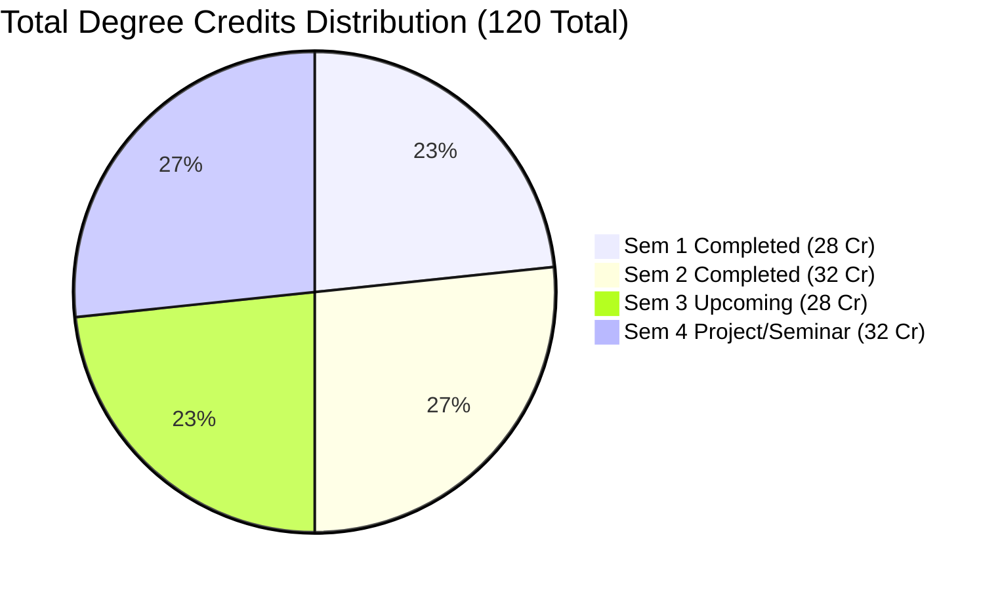
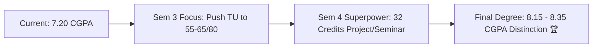

# 🎓 RTMNU MCA — Academic Scorecard & Degree Target Roadmap 🚀

> **Student Name**: Arpit Manoj Bangre  
> **College**: Shri Shivaji Science College, Congress Nagar, Nagpur (Center No: 100 / 144)  
> **University**: Rashtrasant Tukadoji Maharaj Nagpur University (RTMNU)  
> **Course**: Master of Computer Application (MCA - 2 Years CBCS)  
> **Total Degree Credits**: 120 Credits | **Total Degree Marks**: 3000 Marks  

---

## 📌 1. Current Academic Standing (At 50% Completion)

| Metric | Scored / Completed | Total | Percentage / Value | Status |
| :--- | :---: | :---: | :---: | :--- |
| **Credits Earned** | **60.00** | 120.00 | **50.0%** | Halfway Completed |
| **Grade Point Value ($\Sigma GPV$)** | **432.00** | 1200.00 Max | — | — |
| **Current Cumulative GPA (CGPA)** | **7.20 / 10.0** | 10.0 | — | **First Class** |
| **Total Marks Obtained** | **1004** | 1500 | **66.93%** | First Class |

---

## 📜 2. Detailed Semester-Wise History

### 🔹 Semester I (Winter-2025) — SGPA: 7.29 🎯
* **Total Credits**: 28 | **Marks**: 482 / 700 (68.86%) | **$\Sigma GPV$**: 204

| Subject Code | Subject Name | Type | Credits | Theory Univ (TU) /80 | Theory Int (TI) /20 | Total /100 | Grade | Grade Point (GP) | GPV |
| :--- | :--- | :---: | :---: | :---: | :---: | :---: | :---: | :---: | :---: |
| **1T1** | Advanced Java Programming | Theory | 4 | 35 | 19 | 54 | **B** | 6.0 | 24 |
| **1T2** | Data Communication & Network | Theory | 4 | 48 | 19 | 67 | **B+** | 7.0 | 28 |
| **1T3** | Open Source Web Prog. (PHP) | Theory | 4 | 54 | 19 | 73 | **A** | 8.0 | 32 |
| **1T4** | Advanced DBMS & Admin | Theory | 4 | 44 | 19 | 63 | **B+** | 7.0 | 28 |
| **1T5** | Software Engineering | Theory | 4 | 31 | 19 | 50 | **C** | 5.0 | 20 |
| **1P1** | Practical - I | Lab | 4 | 87 (PU) | - | 87 | **A+** | 9.0 | 36 |
| **1P2** | Practical - II | Lab | 4 | 88 (PU) | - | 88 | **A+** | 9.0 | 36 |

---

### 🔹 Semester II (Summer-2026) — SGPA: 7.13 🎯
* **Total Credits**: 32 | **Marks**: 522 / 800 (65.25%) | **$\Sigma GPV$**: 228

| Subject Code | Subject Name | Type | Credits | Theory Univ (TU) /80 | Theory Int (TI) /20 | Total /100 | Grade | Grade Point (GP) | GPV |
| :--- | :--- | :---: | :---: | :---: | :---: | :---: | :---: | :---: | :---: |
| **2T1** | C# & ASP.NET | Theory | 4 | 34 | 18 | 52 | **B** | 6.0 | 24 |
| **2T2** | Cloud Computing | Theory | 4 | 42 | 19 | 61 | **B+** | 7.0 | 28 |
| **2T3** | Computer Graphics | Theory | 4 | 32 | 18 | 50 | **C** | 5.0 | 20 |
| **2T4** | CAO (Elective 1) | Theory | 4 | 28 | 18 | 46 | **C** | 5.0 | 20 |
| **2T5** | Android Programming | Theory | 4 | 45 | 18 | 63 | **B+** | 7.0 | 28 |
| **2P1** | Practical - I | Lab | 4 | 84 (PU) | - | 84 | **A+** | 9.0 | 36 |
| **2P2** | Practical - II | Lab | 4 | 83 (PU) | - | 83 | **A+** | 9.0 | 36 |
| **Project** | Mini Project | Project | 4 | 83 (PU) | - | 83 | **A+** | 9.0 | 36 |

---

## 🔬 3. Diagnostic Breakdown (Strengths vs. Bottlenecks)

### 🌟 Key Strengths
1. **Flawless Internal Assessment (TI)**: Scored **18–19 out of 20** in all subjects.
2. **Elite Practical & Project Performance**: Scored **83 to 88 / 100** (`A+` Grade / 9.0 GP) in every lab and project.
3. **Application & Tech Subjects**: Solid marks in PHP (73), DCN (67), Android (63), ADBMS (63), Cloud (61).

### ⚠️ The Core Bottleneck
* **University Theory Written Exams (TU)**: Hovering in the **28–35 / 80 range** in core theoretical papers (CAO: 28, SE: 31, Graphics: 32, C#: 34, Java: 35).
* This single factor drags total subject marks into 46–54 (`C` and `B` grades), lowering overall SGPA from potential 8.5+ down to ~7.2.

---

## 🎯 4. Final Degree Forecast & Target Scenarios

$$\text{Final CGPA} = \frac{\text{Earned GPV (Sem 1+2)} + \text{GPV}_{\text{Sem 3}} + \text{GPV}_{\text{Sem 4}}}{120} = \frac{432 + \text{GPV}_{\text{Sem 3}} + \text{GPV}_{\text{Sem 4}}}{120}$$

| Scenario | Sem 3 Target (28 Cr) | Sem 4 Target (32 Cr) | Total GPV (/1200) | Final CGPA (/10) | Final Aggregate Marks (/3000) | Final Division |
| :--- | :---: | :---: | :---: | :---: | :---: | :--- |
| **Pace-Keeper (No improvement)** | 7.20 SGPA (201.6 GPV) | 7.50 SGPA (240.0 GPV) | 873.6 | **7.28** | ~2050 (68.3%) | First Class |
| **Realistic Solid Target** | **8.57 SGPA** (240.0 GPV) | **9.25 SGPA** (296.0 GPV) | **968.0** | **8.06** | **~2240 (74.7%)** | **First Class with Distinction** 🏆 |
| **🎯 Recommended Sweetspot** | **8.71 SGPA** (244.0 GPV) | **9.50 SGPA** (304.0 GPV) | **980.0** | **8.17** | **~2290 (76.3%)** | **First Class with Distinction** 🏆 |
| **🌟 High Achiever Push** | **9.14 SGPA** (256.0 GPV) | **9.75 SGPA** (312.0 GPV) | **1000.0** | **8.33** | **~2360 (78.7%)** | **First Class with Distinction** 🏆 |
| **Theoretical Upper Bound** | 10.00 SGPA (280.0 GPV) | 10.00 SGPA (320.0 GPV) | 1032.0 | **8.60** | ~2550 (85.0%+) | Highest Possible Ceiling |

> 📌 **Realistic Target Window**: **8.15 to 8.35 Final CGPA (75% to 78%)** with **First Class with Distinction**.

---

## 📋 5. Subject-by-Subject Target Plan for Semester III

To secure **8.71+ SGPA** in Semester 3, target the following score blueprint:

| Code | Subject Name | Target TU (/80) | Expected TI (/20) | Target Total (/100) | Target Grade | Target GP | Target GPV |
| :--- | :--- | :---: | :---: | :---: | :---: | :---: | :---: |
| **3T1** | 🐘 Big Data Analytics | **55 – 60** | 19 | **74 – 79** | **A** | 8.0 | 32 |
| **3T2** | ⛏️ Data Mining | **55 – 60** | 19 | **74 – 79** | **A** | 8.0 | 32 |
| **3T3** | 🐍 Python Programming | **62 – 68** | 19 | **81 – 87** | **A+** | 9.0 | 36 |
| **3T4** | 🤖 Artificial Intelligence (CE2-1) | **58 – 64** | 19 | **77 – 83** | **A / A+** | 8.0 – 9.0 | 32 – 36 |
| **3T5** | 🧠 Soft Computing | **55 – 60** | 19 | **74 – 79** | **A** | 8.0 | 32 |
| **3P1** | 💻 Practical-I (Big Data, DM, Python) | **85 – 90** | - | **85 – 90** | **A+** | 9.0 | 36 |
| **3P2** | 🧪 Practical-II (AI, Soft Computing) | **85 – 90** | - | **85 – 90** | **A+** | 9.0 | 36 |
| **TOTAL** | | | | **545 – 575 / 700** | | **SGPA ~8.71 – 9.14** | **244 – 256** |

---

## ⚡ 6. Sem 4 Game Plan (The 32-Credit Multiplier)

* In Semester IV, you have **ZERO written theory papers**.
* **Breakdown**:
  * 🛠️ **Project Work (Full Time)**: **24 Credits** | 600 Marks (300 Ext + 300 Int)
  * 🎤 **Seminar**: **8 Credits** | 200 Marks (100 Ext + 100 Int)
* **Strategy**:
  * Build a comprehensive full-stack / AI project early in Sem 3 vacation.
  * Strong project documentation, publication/conference paper if possible, and polished presentation.
  * Target: **85–92% in Sem 4 $\rightarrow$ 9.25 – 9.75 SGPA (GPV 296 – 312)**.

---

## ✍️ 7. Actionable Tactics for RTMNU Written Exams

1. **Structured Presentation**:
   - Start every question with a **definition block** and a **bold summary sentence**.
   - Draw **neat, labeled diagrams** (Architecture diagrams for Hadoop, AI state space trees, ANN layers, Flowcharts). Evaluators look for visual clarity.
2. **Handle Q5 (Compulsory)**:
   - Q5 has 4 sub-questions (4 marks each) from each unit. Do not leave any unit completely unstudied.
3. **Algorithm & Numerical Accuracy**:
   - In **AI** ($A^*, AO^*$, Minimax, Resolution) and **Data Mining** (Apriori candidate generation, K-Means calculation), write out complete step-by-step tables. Numerical questions give full marks.
4. **Keyword Highlighting**:
   - Underline key technical terms (e.g., *heuristic function, admissibility, pruning, support, confidence, backpropagation, membership function*).

---

> 🏆 **Destination**: Finish MCA with **Distinction (8.15+ CGPA / 76%+)**! All in your hands in Sem 3 & 4.
